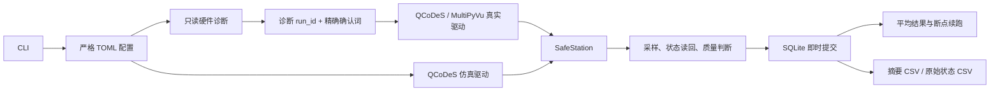

# PPMS QCoDeS Control：目录说明与设计目标

## 1. 项目定位

本项目使用 QCoDeS 统一控制以下仪器：

| 角色 | 仪器 | 功能 |
| --- | --- | --- |
| 激励与纵向锁相 | SR830 | `SINE OUT` 电压激励；测量 `Vxx/1ω/2ω/3ω` |
| 横向锁相 | SR865A | 测量 `Vxy/1ω/2ω/3ω` |
| 上栅源表 | Keithley 2400 | 电压源、限流、输出状态和漏电流测量 |
| 下栅源表 | Keithley 2400 | 电压源、限流、输出状态和漏电流测量 |
| 温度与磁场 | DynaCool PPMS | 通过 MultiPyVu 控制温度、磁场并读取状态 |

SR830 被建模为交流电压源，而不是恒流源。扫描量和数据库中的源设定均为
`Vrms`。样品电流只能通过配置的串联电阻得到估算值：

```text
estimated_current_a = source_voltage_v / series_resistance_ohm
```

这个估算值不是实测电流。真实电流需要在实验室使用参考电阻或其他校准手段确认。

## 2. 目录结构

```text
ppms_qcodes_control/
├── config/
│   ├── simulation.toml
│   └── hardware.example.toml
├── docs/
│   ├── DESIGN_GOALS.md
│   ├── HARDWARE_DIAGNOSTICS.md
│   └── HARDWARE_VALIDATION_CHECKLIST.md
├── src/ppms_control/
├── tests/
├── run_data/                 # 被 Git 忽略
├── .test-tmp/                # 被 Git 忽略
├── pyproject.toml
└── README.md
```

### `config/`

- `simulation.toml`：可直接运行的仿真配置。
- `hardware.example.toml`：真实仪器模板；复制为 `hardware.local.toml` 后填写
  VISA 地址和样品信息。
- 配置采用严格校验：缺失字段、未知字段、非有限数值、SR830 负幅值、越限电压、
  估算电流越限以及温场速率越限都会在连接仪器前被拒绝。

### `src/ppms_control/`

| 文件 | 责任 |
| --- | --- |
| `cli.py` | 配置校验、仿真、只读诊断、授权硬件运行和 CSV 导出 |
| `config.py` | TOML 数据模型与跨字段安全校验 |
| `diagnostics.py` | 不发送设置命令的 VISA/MultiPyVu 诊断 |
| `authorization.py` | 精确确认词、诊断 `run_id` 和配置哈希校验 |
| `real_instruments.py` | SR830、SR865A、Keithley 2400、MultiPyVu 适配器 |
| `instruments.py` | 最小仪器接口、仿真仪器和仪器集合 |
| `safety.py` | 所有写操作共用的 `SafeStation` 安全边界 |
| `protocols.py` | 电压、频率、磁场、温度—磁场和双栅扫描条件与断点续跑 |
| `acquisition.py` | 原始采样、状态读取、平均、质量判断和有限重试 |
| `store.py` | SQLite 运行、事件、尝试、原始仪器状态与 CSV |
| `hardware_run.py` | 授权、连接、温场准备、扫描、审计和清理 |
| `models.py` | 条件、读数、物理状态和尝试结果数据结构 |

### `tests/`

自动测试不连接真实仪器，覆盖配置、安全限制、诊断、授权、真实驱动假后端、
端到端仿真、原始状态持久化、失败重试和断点续跑。测试通过只证明软件行为，
不能替代实验室接线、校准和安全验证。

## 3. 控制与数据流程



每个测量点按以下顺序执行：

1. 校验 SR830 电压、估算电流、温度、磁场、栅压/漏电、稳定状态和锁相参考状态。
2. 设置 SR830 正弦输出幅值并等待稳定时间。
3. 每次原始采样读取两台锁相的 X/Y、频率、谐波、锁定和过载状态。
4. 同一次采样读取 SR830 幅值、两台 SMU 状态/电流，以及 PPMS 温场与腔体状态。
5. 将原始记录立即提交到 SQLite `instrument_samples`；被拒绝的尝试也保留。
6. 完成平均和质量判断后写入 `attempts`，失败时进行有限次数重试。
7. 每次尝试结束把 SR830 降到配置的最小安全幅值。
8. 运行结束时关闭两台栅极输出，并将程序拥有的磁场请求回零。

## 4. SQLite 数据目标

SQLite 是原始审计数据源，CSV 是派生副本。

- `runs`：配置哈希、完整配置、Station snapshot、运行状态和时间。
- `events`：诊断、授权、异常、清理和停机后状态。
- `attempts`：每个条件的平均值、标准差、质量标记和错误。
- `instrument_samples`：每次原始采样的完整物理状态和测量值。

`instrument_samples` 包含：

- SR830 设定/读回幅值、X/Y、频率、谐波、锁定和过载；
- SR865A X/Y、频率、谐波、锁定和过载；
- 两台 Keithley 的源电压、输出状态、compliance、测得电流及
  `current_available`；输出关闭时电流值不可用；
- PPMS 设定/实测温度与磁场、状态字符串、腔体状态和稳定标志；
- UTC 时间、条件、尝试号和采样号。

真实实验的活动数据库应放在 PPMS 电脑的本地非同步磁盘，关闭数据库后再归档。

## 5. 安全设计

- SR830 幅值限制默认为仪器允许的 `0.004–5 Vrms`，仍受配置中的更严格限制约束。
- SR830 不支持软件设置真正的 `0 V`；`source_safe_idle_voltage_v` 是最小安全幅值，
  默认 `0.004 Vrms`，不得称为物理零电流。
- 电压除以串联电阻得到的估算电流还必须低于配置的估算电流限制。
- 两台 Keithley 在构造后首先关闭输出、选择电压源/电流测量并设置 compliance。
- 双栅扫描支持二维蛇形网格和已确定轨迹的Vg1/Vg2配对线扫，并采用受限步长；每个
  斜坡步和原始采样都核验栅压、输出状态、compliance、温度和漏电，正常结束斜坡归零，
  异常执行双栅零/关输出清理。软件漏电终止值必须低于硬件compliance。
- PPMS 温度、磁场、速率和稳定等待均有配置边界与超时。
- 一个清理步骤失败不能阻止其他设备继续执行安全清理。
- 软件保护不能替代实验室联锁、硬件限流、急停和现场操作员。

## 6. 真实硬件入口

真实运行要求：

1. `runtime.simulation = false` 且配置中没有占位符。
2. 使用完全相同的配置成功执行 `diagnose-hardware`。
3. 提供该诊断的 `run_id`。
4. 精确输入 `I CONFIRM REAL HARDWARE CONTROL`。
5. 完成 `HARDWARE_VALIDATION_CHECKLIST.md` 中适用阶段。

实验室仍需确认 SR830 输出接线、串联电阻、实际电流、最小安全幅值、SMU 极性、
PPMS 场方向和所有样品安全限制。自动测试不能完成这些物理验证。

## 7. 后续目标

- 在真实仪器上按检查清单完成低幅值验证；
- 根据实际接线校准电压到样品电流的换算；
- 在真实仪器上分级验证温度—磁场和双栅扫描；
- 根据真实噪声和时间常数优化锁相量程、等待时间与质量规则；
- 在硬件数据验证后增加实验分析、绘图和报告。
